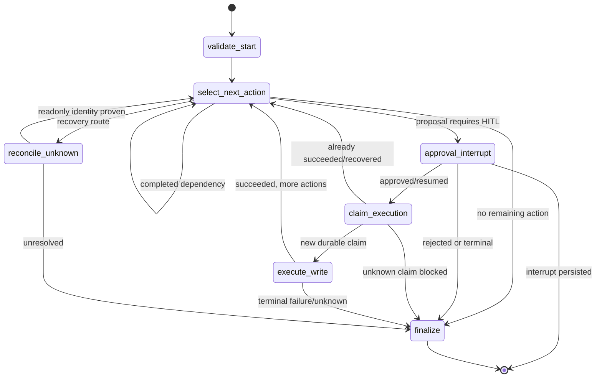

# LangGraph lifecycle

The graph is built by `inbox2action.stage3.graph.build_email_action_graph` and
is shared by the Gmail Worker and the approval API. The planner supplies the
validated workflow state; the graph owns durable transitions and execution.



The operational lifecycle is:

```text
Gmail poll
  -> MIME/body adapter and normalize_email
  -> GmailStage2Planner / CalendarStage8Planner
  -> bounded Tool Loop (Tool call -> observation -> next Agent turn)
  -> ActionProposal
  -> approval_interrupt / HITL
  -> ApprovalService.decide(Command(resume=...))
  -> ExecutionPermit
  -> PostgresExecutionLedger claim
  -> provider executor or FixtureWriteExecutor
  -> result / resource identity
  -> memory update and finalize
```

## State responsibilities

Short-term workflow state is the checkpoint. `AsyncPostgresSaver` stores the
current `WorkflowState`, approval revision, action status, completed action IDs,
audit events and the current `thread_id`, so an interrupt can resume after an
API/Worker process restart. The same `thread_id` is required for a resume; a
new thread would be a new workflow, not recovery.

Long-term memory is separate. `AsyncPostgresStore` is accessed through
`MemoryService` and stores account-scoped preference facts with provenance,
versioning and replay handling. It is a soft preference input for a future
workflow; it cannot change trusted configuration, tool permissions, or an
approved payload. Neither store is a chat-history transcript.

## Why the graph can safely re-enter

An interrupt can cause the node boundary to be revisited when the process
resumes. The durable ledger protects the external side effect: a succeeded
idempotency key returns `ALREADY_SUCCEEDED`, while an `UNKNOWN` outcome can
only proceed through the explicit readonly reconciliation route. The provider
POST is never replayed merely because the client or process timed out.
